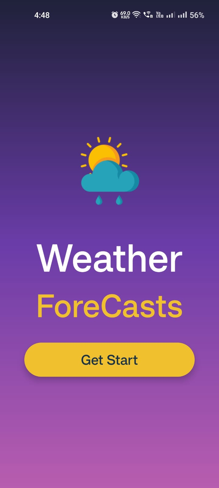
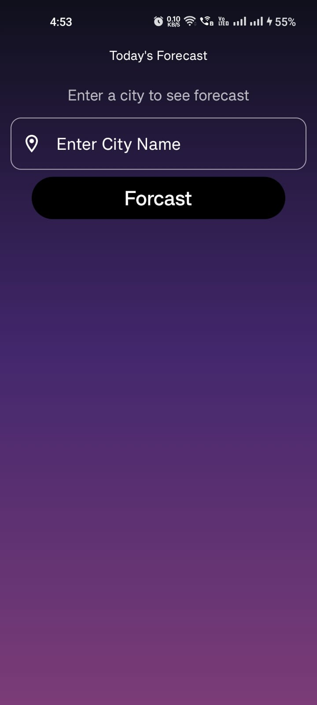
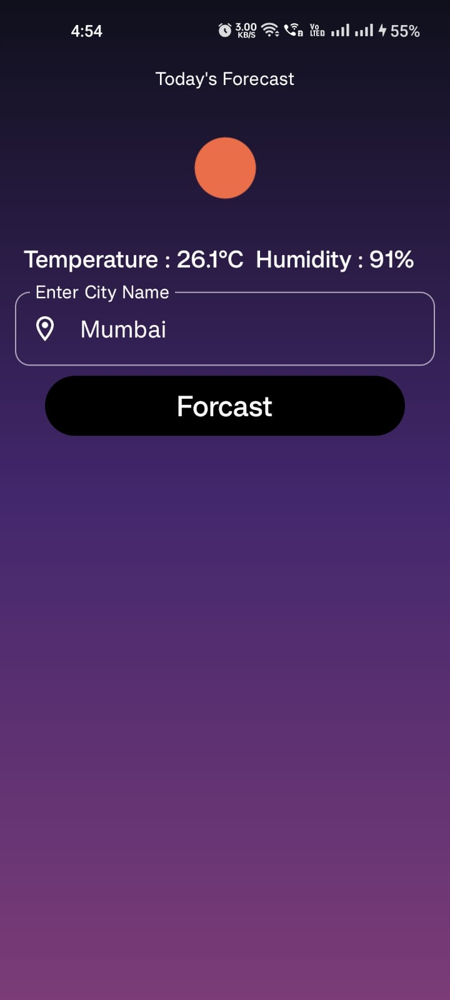

* **Attractive** → Screenshots, badges, emojis
* **Informative** → Tech stack, architecture, features, setup
* **Developer-friendly** → Clear install/run steps
* **Professional** → Structured & polished


---

# ☀️ Weather Forecast App

An elegant **Weather Forecast App** built with **Jetpack Compose** following **Google’s recommended MVVM architecture**.
Minimal, scalable, and modern — designed with best practices in mind. 🚀

---

## ✨ Features


- [x] 🎨 **Jetpack Compose UI** – Beautiful, declarative UI  
- [x] 🧭 **Navigation Component** – Seamless screen transitions  
- [x] 🗂️ **MVVM + StateFlow** – Clean architecture with unidirectional data flow  
- [x] 🌐 **Weather API Integration**
- [x] ⚡ **Kotlin Coroutines** – Asynchronous, responsive experience  
- [ ] 📐 **Responsive UI** – Adapts to different screen sizes  
- [ ] 🌙 **Dark/Light Theme Support** – (Planned)  


---

## 📸 Screenshots

| Welcome Screen                                   	| Forecast Screen                                   |
| ------------------------------------------------ 	| ------------------------------------------------- |
|  |  |
| Welcome Screen                                   	| 	                                  				|
| ------------------------------------------------ 	| -------------------------------------------------  |
|  |  													|
---

## 🏗️ Architecture

This project strictly follows **Google’s official architecture guidance** for Android apps:

```
Presentation (UI) → ViewModel → Repository → Data Source
```

* **UI Layer** → Jetpack Compose + Material3
* **ViewModel Layer** → `StateFlow` for reactive state management
* **Data Layer** → Repository pattern to handle API/Local data
* **Dependency Injection** → Hilt (if added later)

---

## 🛠️ Tech Stack

* [Kotlin](https://kotlinlang.org/) – 100% Kotlin
* [Jetpack Compose](https://developer.android.com/jetpack/compose) – Modern UI toolkit
* [Material3](https://m3.material.io/) – Clean design system
* [ViewModel](https://developer.android.com/topic/libraries/architecture/viewmodel) + [StateFlow](https://developer.android.com/kotlin/flow/stateflow-and-sharedflow)
* [Coroutines](https://kotlinlang.org/docs/coroutines-overview.html) – Async programming
* [Navigation Compose](https://developer.android.com/jetpack/compose/navigation)
* (Optional) [Retrofit](https://square.github.io/retrofit/) / [Ktor](https://ktor.io/) – For weather API calls

---

## 🚀 Getting Started

### 1️⃣ Clone the repo

```bash
git clone https://github.com/your-username/weather-forecast-app.git
cd weather-forecast-app
```

### 2️⃣ Open in Android Studio

* Use **Android Studio Ladybug (or latest)**
* Ensure **Kotlin + Compose** plugins are up-to-date

### 3️⃣ Run the app

* Connect a device/emulator
* Hit **Run ▶️**

---

## 📂 Project Structure

```
weather-forecast-app/
│── app/
│   ├── data/        # Data sources (API, local, repo)
│   ├── ui/          # Compose UI screens
│   ├── viewmodel/   # ViewModels with StateFlow
│   ├── di/          # Hilt modules (if added)
│   └── utils/       # Helpers/extensions
```

---

## 🤝 Contributing

Contributions are welcome! 🎉

* Fork the repo
* Create a feature branch
* Submit a PR 🚀

---

## ⭐ Support

If you find this project helpful, consider **starring ⭐ the repo** — it helps more people discover it!

---

## 📜 License

MIT License © 2025 [Your Name](https://github.com/your-username)

---

💡 **Pro Tip:** Adding a **project banner** (a wide image at the top with app branding) + **GitHub badges** (build status, Kotlin version, license) will make your repo *very attractive*.

---

👉 Do you want me to also **design a banner image** (like the ones you see on trending Android repos), so your README stands out visually?
